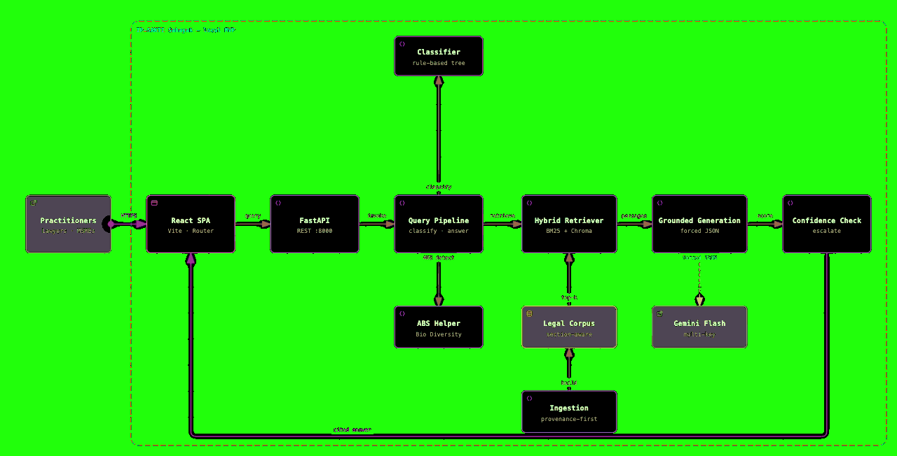
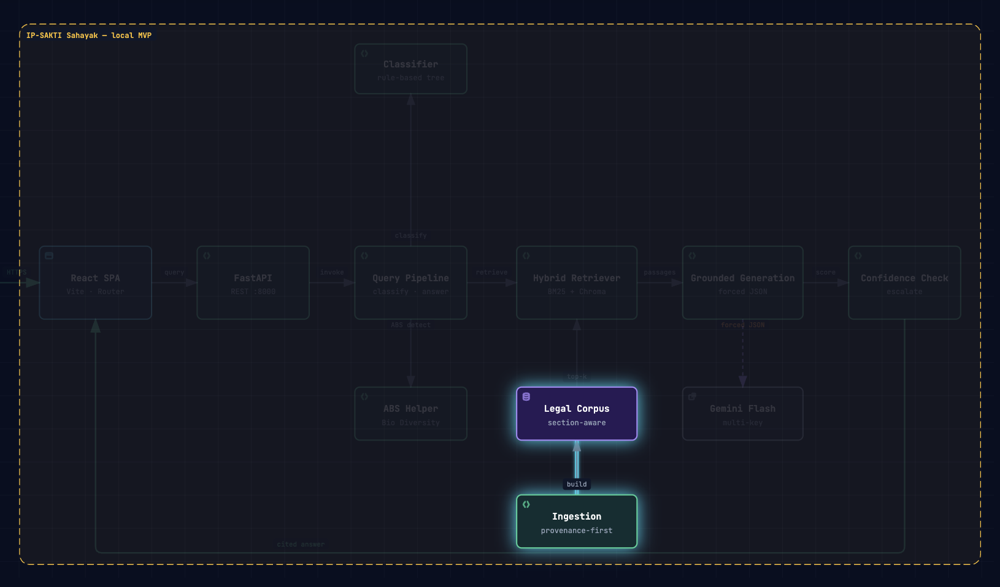
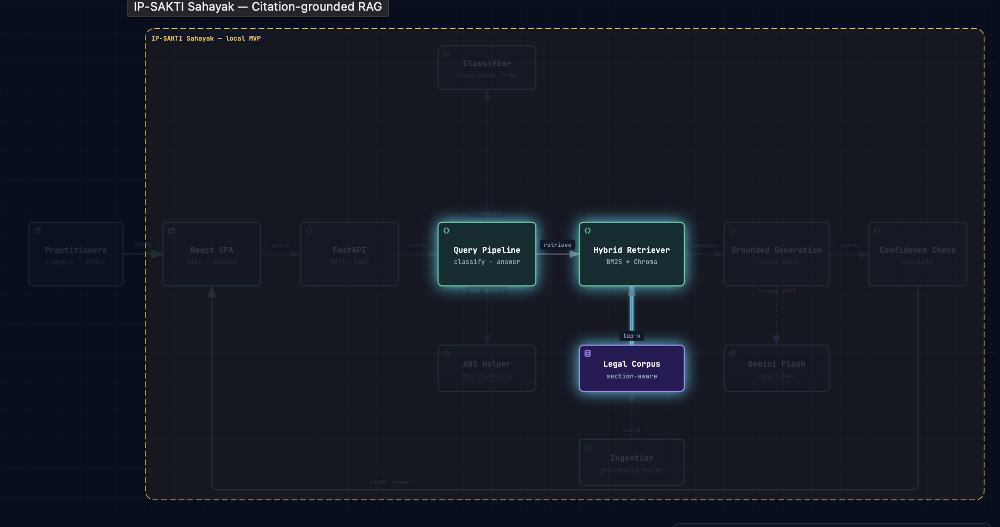
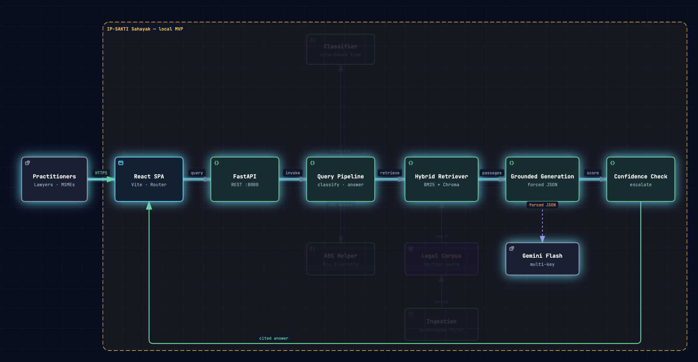

<p align="center">
  
</p>

# IP-SAKTI Sahayak

> Citation-grounded RAG assistant for Ayurveda intellectual property and
> regulatory guidance — **Smart India Hackathon 2026 · Problem Statement 26045 ·**
> **Ministry of AYUSH / All India Institute of Ayurveda (AIIA)**

IP-SAKTI Sahayak answers Indian and international intellectual-property,
access-and-benefit-sharing (ABS), and regulatory questions about Ayurveda —
**every answer traces back to a real statute, rule, treaty, or protocol section in our
curated corpus, or it escalates to a human instead of inventing a citation.**

No mock answers on the core loop. No hallucinated legal text. Retrieval quality
is measured and surfaced; when retrieval is weak or the model is unavailable,
the system says so — escalates — and never fabricates a source.

[](https://github.com/mudit-sonie/IP-SAKTI-Sahayak/actions/workflows/backend.yml)


---

## The problem

Researching Ayurveda IP is a **fragmentation nightmare**. A single question can
touch four different legal worlds at once:

- **Patents** — the Patents Act 1970, section **3(d)** / **3(p)** and the patentability
  of traditional-knowledge-derived inventions;
- **Biological diversity & ABS** — the Biological Diversity Act 2002 and Rules 2024
  (obtaining approval, benefit sharing, non-disclosure), the CBD and the **Nagoya Protocol**;
- **Drugs & consumer-protection** — the Drugs and Cosmetics Act/Rules, the Magic
  Remedies (Objectionable Advertisements) Act 1954, and the FSSAI **Ayurveda Aahara** Regulations 2022;
- **Brands & origin** — the Trade Marks Act 1999 and the **Geographical Indications** Act 1999;
- plus the **TRIPS Agreement** and international obligations that shape all of the above.

Statutes sit in different ministries' portals, have different edition dates, and
are dense legal text. Researchers, startups, and lawful users need one grounded
tool that finds and cites the exact provisions — not a paraphrase.

## The solution

**IP-SAKTI Sahayak** is a hybrid-retrieval RAG assistant that:

1. **Classifies** every question into a legal category;
2. **Retrieves** the most relevant statute/treaty sections; hybrid **BM25 + vector**, jurisdiction-routed;
3. **Runs an ABS second pass** when the question touches biological resources;
4. **Generates** a grounded answer with **filtered citations** (the model can only
   cite passages that were actually in its context);
5. **Scores its own confidence** and, when below threshold, **escalates** rather than invents.

> **The core promise — no mocks on the core loop.** Every demoed answer must trace
> to a real statute/treaty section in the corpus. If it can't, we escalate.

## Demo

[](assets/ip-sakti-sahayak-citation-grounded-rag.gif)

---

## Architecture

```text
 User question
     │
     ▼
 ┌──────────────────────────────────────────────────────────────┐
 │  Formulation classifier  (rule-based decision tree)          │
 │  → patent · trademark · abs · drugs · GI · regulatory · ...  │
 └──────────────────────────────────────────────────────────────┘
     │  jurisdiction toggle (india | international, default india)
     ▼
 ┌──────────────────────────────────────────────────────────────┐
 │  Hybrid retrieval — BM25 + Chroma, jurisdiction-routed       │
 │  fused = w·bm25_norm + (1−w)·vector_norm    (w = 0.5)        │
 └──────────────────────────────────────────────────────────────┘
     │
     ├──────── if biological-resource touch ────────────┐
     ▼                                                   ▼
 ┌──────────────────────┐                ┌──────────────────────────────┐
 │   Grounded generation│                │  ABS second pass             │
 │   (Gemini, forced   │                │  → Biodiversity Act + Rules  │
 │   JSON answer/cites)│                └──────────────────────────────┘
 └─────────┬───────────┘
     │
     ▼
 ┌──────────────────────────────────────────────────────────────┐
 │  Confidence check                                             │
 │  retrieval top-score ≥ threshold  +  self_confidence          │
 │   ≥ threshold → cited answer       < threshold → escalate     │
 └──────────────────────────────────────────────────────────────┘
```

### Pipeline diagrams

| Corpus ingestion | Hybrid retrieval |
|---|---|
|  |  |

| Query flow | RAG + guardrails |
|---|---|
|  |  |

### Data flow

```text
Official legal sources
        │  PDF / OCR / structure-aware parsing / section-clause chunking
        ▼
cleaned chunks (chunks.jsonl — committed, 902 chunks)
        │   build_index.py  (embedding model downloaded locally)
        ▼
BM25 index (rank_bm25)  +  Chroma vector DB
        │   hybrid fusion (w = HYBRID_BM25_WEIGHT = 0.5)
        ▼
Retrieved passages  →  Gemini (forced JSON)  →  filtered citations
        │
        ▼
Confidence gate  ──thresh──▶ cited answer      or      escalate
```

---

## Features

- **Process-level, chunked grounding** — sections/chapters, never raw token windows.
- **Hybrid retrieval** — BM25 + dense embeddings, fused and jurisdiction-routed.
- **Two-country coverage** — Indian statutes `+` international treaties (TRIPS, CBD, Nagoya).
- **ABS second pass** — automatic deep-dive into the Biodiversity Act + Rules for
  biological-resource questions.
- **Citation filtering** — the model cannot cite a source that wasn't in its context.
- **Confidence & escalation** — retrieval-score threshold (primary) + self-reported
  confidence (secondary); weak evidence → `status: escalate`, never a guess.
- **Multi-key Gemini rotation** — comma-separated keys, rotated on quota errors.
- **ABS / patentability / entity lookups** — regulatory details, fees estimates,
  patent status, comparative answers, state-localized rules, and translation
  surfaced by dedicated endpoints.
- **Low-code, local deploy** — everything free-tier and runs on a laptop; zero cloud credits.

## Corpus (knowledge base)

The knowledge base covers **13 authoritative sources across 8 groups** — prefer
official government / treaty publications (India Code, IP India, CDSCO, FSSAI,
WTO, CBD/Nagoya) over third-party copies.

| Group | Sources | Jurisdiction |
|---|---|---|
| **Patents** | The Patents Act, 1970 · The Patents Rules, 2003 (amendments till 15-03-2024) | 🇮🇳 India |
| **Biological diversity / ABS** | The Biological Diversity Act, 2002 · The Biological Diversity Rules, 2024 | 🇮🇳 India |
| **Drugs & advertising** | Drugs and Cosmetics Act, 1940 · Drugs and Cosmetics Rules, 1945 · Magic Remedies (Objectionable Advertisements) Act, 1954 | 🇮🇳 India |
| **Food / Ayurveda Aahara** | FSSAI (Ayurveda Aahara) Regulations, 2022 | 🇮🇳 India |
| **Geographical indications** | GI of Goods (Registration and Protection) Act, 1999 | 🇮🇳 India |
| **Trade marks** | The Trade Marks Act, 1999 | 🇮🇳 India |
| **International law** | TRIPS Agreement · Convention on Biological Diversity · Nagoya Protocol | 🌍 International |

> The committed retrieval index currently carries **902 chunks** ingested from
> this corpus. Legal text is authoritative — it is never rewritten, summarised, or
> paraphrased during ingestion. See [`corpus/README.md`](corpus/README.md).

## Tech stack

| Layer | Choice | Why |
|---|---|---|
| **LLM** | Gemini (Flash), multi-key rotation via `app/llm/gemini_client.py` | Free tier, low latency |
| **Dense retrieval** | `bge-small-en` / `all-MiniLM-L6-v2` (sentence-transformers) | Local, no cloud cost |
| **Sparse retrieval** | `rank_bm25` (in-process) | Deterministic keyword recall |
| **Vector store** | Chroma (embedded/local) | Zero-infra vector search |
| **Backend** | FastAPI | Contract-first, typed (`app/schemas.py` is the source of truth) |
| **Frontend** | React 18 + Vite + react-router | Fast dev, typed via TS |
| **CI** | GitHub Actions (`pytest` on Ubuntu) | Guards the classifier tree, contract shapes, escalate/fallbacks |

All free-tier / local.

## API contract

The backend is contract-first; **`backend/app/schemas.py` is the source of truth**
for every endpoint shape. The frontend builds each screen against these shapes.

| Method | Path | Purpose |
|---|---|---|
| `GET` | `/health` | Liveness + index readiness |
| `POST` | `/classify` | Formulation classifier result |
| `POST` | `/query` | **Core** grounded answer: `answer / citations / self_confidence / status` |
| `POST` | `/abs-check` | ABS second pass over Biodiversity Act + Rules |
| ... | `/compare`, `/chunk/{id}`, `/corpus`, `/fees`, `/fees/estimate`, `/analytics`, `/languages`, `/translate`, `/state-rules`, `/draft-kinds`, `/feedback`, `/matters`, `/facilitator` | Regulatory detail, retrieval transparency, fees, localization, and workflow helpers |

Interactive docs are served at `http://localhost:8000/docs` (OpenAPI).

## Getting started

### Prerequisites

- Python **3.10+** · Node **18+**
- A Google AI Studio API key (free, ~20 req/day/key — grab a few):
  <https://aistudio.google.com/apikey>

### 1. Backend

```bash
cd backend
python -m venv .venv
. .venv/bin/activate                      # Windows: .\.venv\Scripts\activate
pip install -r requirements.txt

cp .env.example .env                      # then edit — see below

# Build retrieval indices from the committed chunks.jsonl
# (first run downloads the ~130 MB embedding model; ~3 min to embed on CPU)
python -m scripts.build_index

./run.sh                                  # Windows: .\run.ps1  (or uvicorn app.main:app --reload)
# -> http://localhost:8000/docs
```

**`backend/.env`** — the only required setting is the Gemini keys:

```bash
GEMINI_API_KEYS=key1,key2,key3        # comma-separated; client rotates on quota errors
GEMINI_MODEL=gemini-3.5-flash-lite
```

Everything else has sane defaults (`RETRIEVAL_ESCALATE_THRESHOLD=0.35`,
`HYBRID_BM25_WEIGHT=0.5`, etc.). **Without keys the backend still runs** — every
`/query` returns `status: escalate` by design (no mocks on the core loop).

Optional for instant demos (pre-answers gold questions without burning quota):

```bash
python -m scripts.warm_cache
```

### 2. Frontend

```bash
cd frontend
npm install
cp .env.example .env                  # VITE_API_BASE_URL=http://127.0.0.1:8000 (default fine)
npm run dev                           # -> http://localhost:5173
```

Start the backend first; the frontend calls it on `:8000`.

## Usage example

```text
Q: Is a formulation based on a traditional Ayurvedic knowledge patentable in India?

A: Possibly blocked under Section 3(d) / 3(p) of the Patents Act, 1970 and,
   being derived from biological resources, an ABN/approval under the Biological
   Diversity Act, 2002 may be required before exploitation.

   [1] The Patents Act, 1970 — Section 3(d)
   [2] The Patents Act, 1970 — Section 3(p)
   [3] The Biological Diversity Act, 2002 — Sections 3, 6
```

> Confidence: **high** · Status: **cited** — every citation above is a real
> retrieved corpus passage, filtered before generation.

## Project structure

```
IP-SAKTI-Sahayak/
├── corpus/                      # source legal PDFs = knowledge base (India + International)
│   ├── india/                   #       01..06 → patents, biodiversity, drugs, aahara, TM, GI
│   ├── international/           #       07 → TRIPS · 08 → CBD + Nagoya
│   └── README.md                # authoritative source list + ingestion pipeline
├── backend/                     # FastAPI RAG backend
│   ├── app/
│   │   ├── main.py              # FastAPI app + routes
│   │   ├── config.py            # env-driven tunables (threshold, hybrid weight, keys)
│   │   ├── schemas.py           # ★ API contract (source of truth)
│   │   ├── routes.py / pipeline.py
│   │   ├── llm/gemini_client.py # multi-key rotation
│   │   ├── retrieval/hybrid.py  # BM25 + Chroma fusion, jurisdiction-routed
│   │   └── services/            # classifier, generation, confidence, abs_helper
│   ├── scripts/                 # build_index, ingest_corpus, warm_cache
│   ├── tests/                   # 27 pytest files
│   └── data/processed/chunks.jsonl   # committed retrieval corpus (902 chunks)
├── frontend/                    # React 18 + Vite app (wired to live API)
│   └── src/                     # pages, components, state (react-router)
├── assets/                      # diagrams & demo GIF used in this README
├── PRD_Tech_Team_IP-SAKTI-Sahayak.md   # authoritative spec
├── STATUS.md                    # live task board (updated by lead)
└── README.md
```

## Tuning & configuration

Tunables live in **`backend/app/config.py`** (env-driven) — tuned on Day 4 of the
build, never hardcoded in code:

| Variable | Default | Purpose |
|---|---|---|
| `GEMINI_API_KEYS` | — | Comma-separated keys, rotated on quota |
| `GEMINI_MODEL` | `gemini-3.5-flash-lite` | Generation model |
| `RETRIEVAL_ESCALATE_THRESHOLD` | `0.35` | Primary confidence gate (retrieval top-score) |
| `HYBRID_BM25_WEIGHT` | `0.5` | Hybrid fusion: `w·bm25 + (1−w)·vector` |
| `DATA_DIR` | `backend/data` | Processed chunks, indices, cache, feedback |

## Rebuilding the corpus & indices

```bash
# cleaned text → chunks.jsonl  (deterministic ingestion, chunk by section/clause)
cd backend && python -m scripts.ingest_corpus          # --stdout for a dry run

# chunks.jsonl → BM25 + Chroma indices
cd backend && python -m scripts.build_index

# pre-answer gold questions (instant demos, saves quota)
cd backend && python -m scripts.warm_cache
```

See the [`legal-corpus-ingestion`](.claude/skills/legal-corpus-ingestion/SKILL.md)
skill rules — legal text is authoritative, chunk by section/clause, **never** by
token window.

## Testing & CI

```bash
cd backend && pytest            # 27 test files: classifier tree, contract shapes, escalate/fallbacks
```

GitHub Actions runs `pytest` on each push to `backend/**` (Python 3.10, light deps):
it exercises the classifier tree, contract shapes, and the escalate / no-vector
fallbacks with no Gemini key needed.

```bash
cd frontend && npm run build && npm run lint
```

## Known gotchas

- **`backend/data/chroma/`, `data/cache/`, `data/feedback.jsonl` are gitignored** —
  rebuilt locally. `chunks.jsonl` **is** committed, so you can run retrieval
  without the raw corpus.
- **Gemini quota:** ~20 req/day/key. If `/query` returns the escalation stub with
  `retrieval 100%`, you've hit the daily limit — add keys or use the cache.
- **`corpus/` folder names must not contain `:`** (macOS artifact — fixed; never
  merge stale branches that mass-delete `corpus/`).

## Roadmap

See [`PRODUCT_ROADMAP.md`](PRODUCT_ROADMAP.md) and the live board in
[`STATUS.md`](STATUS.md). Notable directions:

- **[S14]** Judicial-decision (case law) ingestion — courts apply the law, they are
  never a *primary* citation; surfaced as "how courts applied this."
- **Expanded corpus** — more amendments, more jurisdictions, traditional-knowledge references.
- **Retrieval & confidence tuning** — threshold/weight tuned against the gold set.

## Contributing

- Read the spec **[`PRD_Tech_Team_IP-SAKTI-Sahayak.md`](PRD_Tech_Team_IP-SAKTI-Sahayak.md)** before making design decisions — the core rule is **no mocks on the core loop**.
- Follow the contributor guide and conventions in **[`CLAUDE.md`](CLAUDE.md)**.
- Keep `backend/app/schemas.py` the source of truth for the API contract —
  changing a shape is a breaking change, announce it.
- Commit in small, focused chunks; no AI co-author signatures in this repo.

## Disclaimer

IP-SAKTI Sahayak is an **AI-assisted legal information & research system**. Output
is for research and informational purposes only and is **not** a substitute for
professional legal advice. Always verify against the cited official provisions.

## License

Copyright © 2026 IP-SAKTI Sahayak team, Ministry of AYUSH / AIIA Smart India
Hackathon 2026 (PS 26045). All rights reserved. Not open-sourced.

## Team

- **Mudit Sonie**
- **Anuj Paroha**
- **Avishi Poddar**
- **Dewashish Lambore**
- **Kavish Nag**
- **Poorvi Dhall**